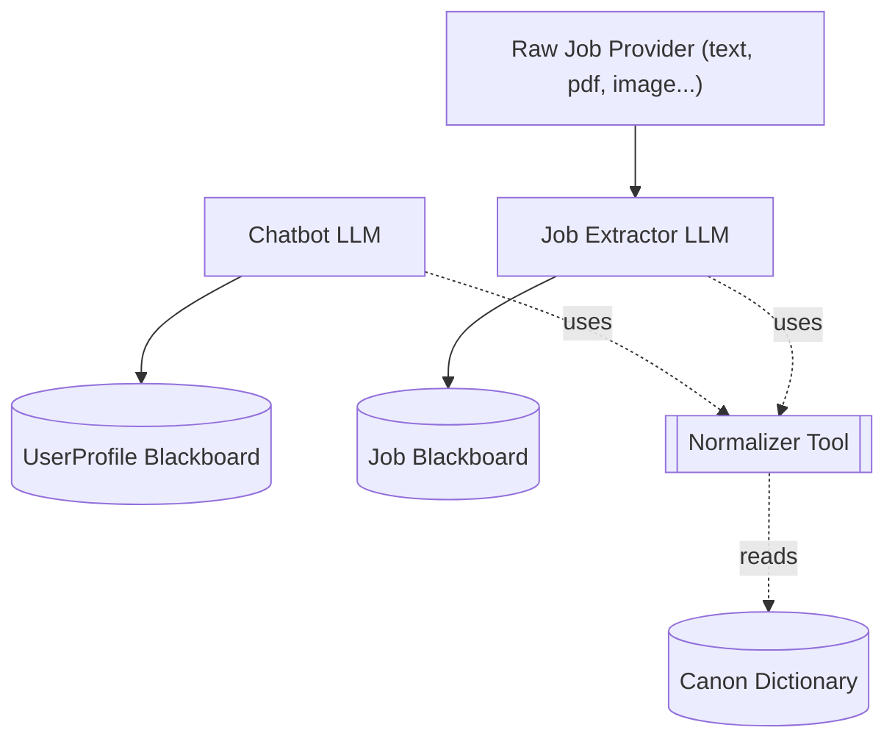
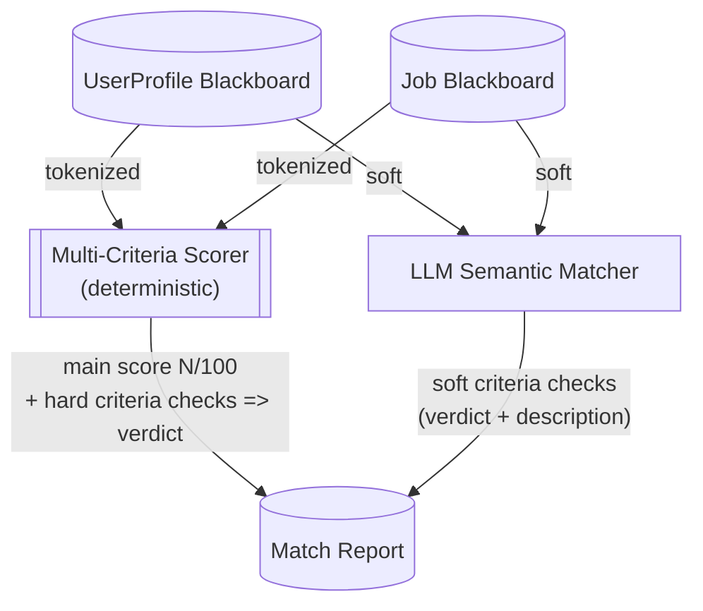
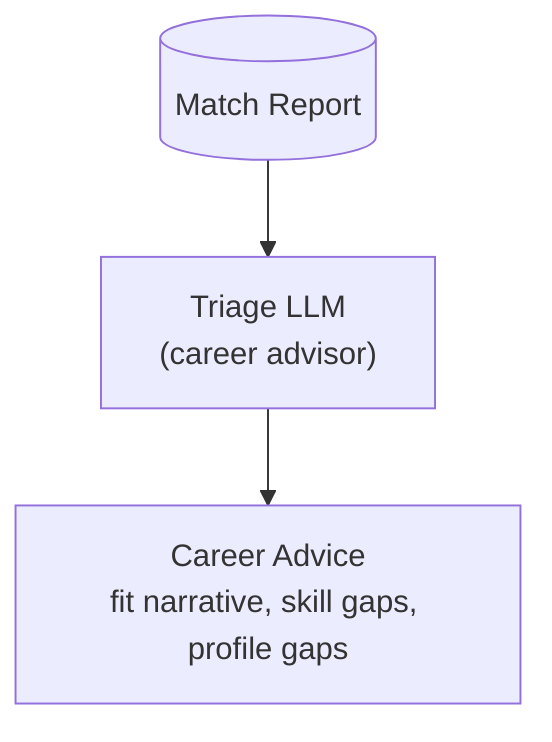

# Workflow Diagrams

## Step 1: Data Collection.

## Step 2: Matching.

Both blackboards hold two kinds of fields: **tokenized** (normalized, deterministic) and **soft** (semantic, qualitative). They flow down two parallel paths and merge in a single Match Report.

## Step 3: Triage (career advisor).

